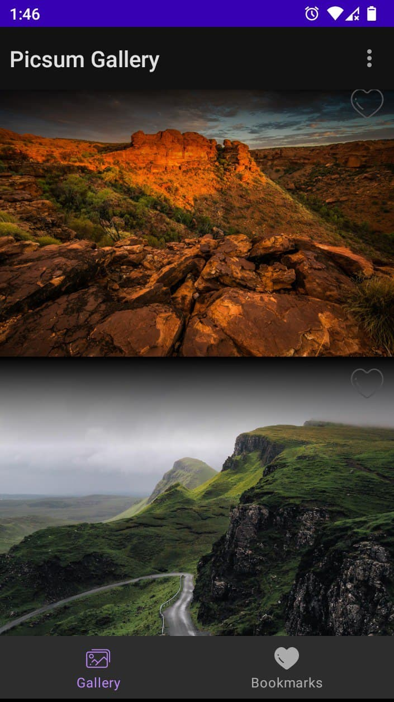
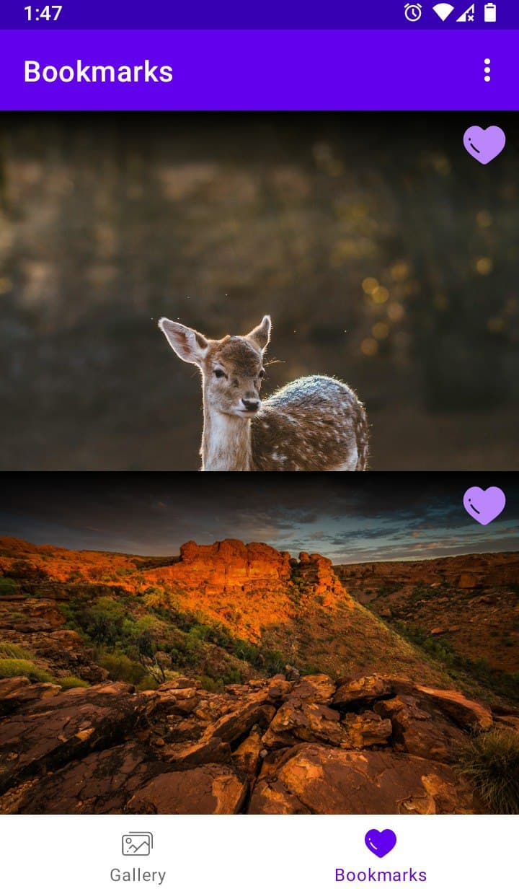
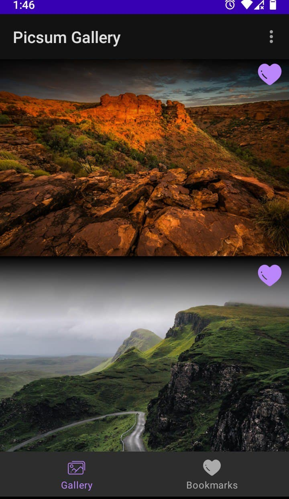

# Picsum Photos <image src="/images/photo_z.jpg" width=50 height=50>

## Screenshots

	
## MVVM architecture example in Kotlin

## API:
* https://picsum.photos/

## Technologies used:

The main purpose of the application is to showcase the recent architecture best practices

* [Retrofit](https://square.github.io/retrofit/) a REST Client for Android.
* [Hilt](https://dagger.dev/hilt/) for dependency injection.
* [ViewModel](https://developer.android.com/topic/libraries/architecture/viewmodel) to store and manage UI-related data in a lifecycle conscious way.
* [LiveData](https://developer.android.com/topic/libraries/architecture/livedata) to handle data in a lifecycle-aware fashion.
* [Navigation Component](https://developer.android.com/guide/navigation) a single-activity architecture to handle all navigation and also passing of data between destinations with [SafeArgs](https://developer.android.com/guide/navigation/navigation-pass-data) plugin.
* [Paging](https://developer.android.com/topic/libraries/architecture/paging/v3-overview) for displaying pages of data from a larger dataset from local storage or over network.
* [Glide](https://bumptech.github.io/glide/) for image loading.
* [Coroutines](https://kotlinlang.org/docs/reference/coroutines-overview.html) used to manage the local storage i.e. `writing to and reading from the database`. Coroutines help in managing background threads and reduces the need for callbacks.
* [Room](https://developer.android.com/topic/libraries/architecture/room) persistence library which provides an abstraction layer over SQLite to allow for more robust database access while harnessing the full power of SQLite.

